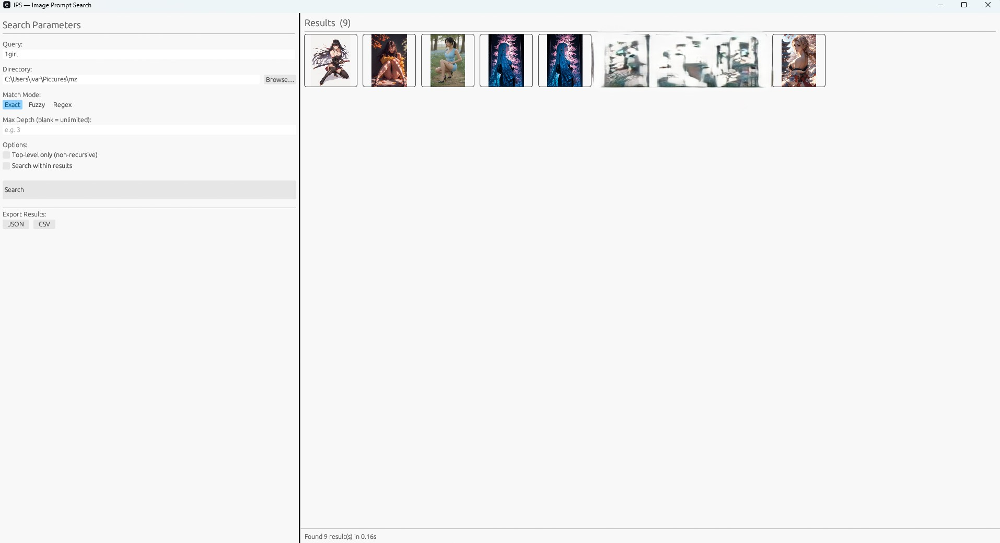
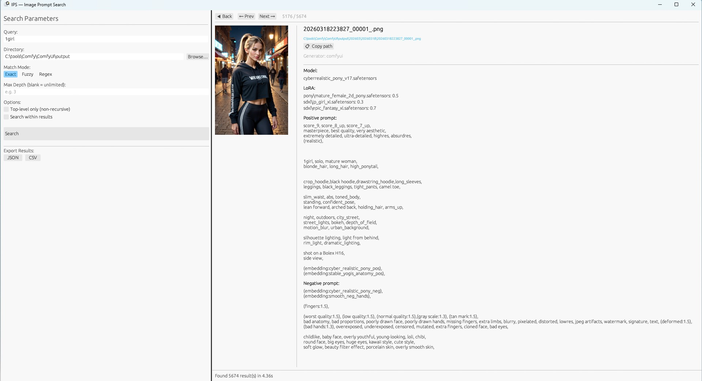

# ips_gui — Image Prompt Search GUI

A native desktop GUI for searching AI-generated image prompts embedded in PNG, JPEG, and WebP metadata. Supports Stable Diffusion (A1111/Forge), ComfyUI, NovelAI, and InvokeAI. Self-contained — no external library crate required.

## Requirements

- Rust 1.75 or later

## Build

```bash
cargo build --release
./target/release/ips_gui        # macOS / Linux
target\release\ips_gui.exe      # Windows
```

## Pre-built Binaries

Pre-built binaries for Windows (x86-64), macOS (Apple Silicon), and Linux (x86-64) are attached to each [GitHub Release](../../releases).

## Interface

### Grid view



### Detail view (click any thumbnail)



## Controls

### Search Parameters (left panel)

| Control | Description |
|---|---|
| **Query** | Text to search for. Press Enter or click Search to run. |
| **Directory** | Root directory to search. Type a path or click **Browse…** to pick a folder. Defaults to `.`. |
| **Match Mode** | `Exact` — case-insensitive substring (default). `Fuzzy` — approximate match via Skim algorithm. `Regex` — regular expression (validated before search). |
| **Min Score** | Fuzzy mode only. Slider 0–100; results below the threshold are excluded. Default: 50. |
| **Max Depth** | Limit directory recursion depth. Blank = unlimited. |
| **Top-level only** | Search only the immediate contents of the directory, no subdirectories. |
| **Search within results** | Visible only when results are present. When checked, Search filters the current result set instead of re-scanning the filesystem. Useful for iterative refinement. |
| **Search button** | Disabled while a search is running or the query is empty. |

### Drag and drop

Drop items onto the left Search Parameters panel:

| Drop item | Behavior |
|---|---|
| **One supported image** | Clears current results and opens the image detail view with parsed metadata. |
| **Multiple supported images** | Rejected with `Please drop one image at a time.` |
| **One folder** | Sets **Directory** to that folder only. It does not auto-search; enter a query and click **Search**. |

Supported dropped image formats are PNG, JPEG/JPG, and WebP.

### Results — Grid view (central panel)

Matched images are displayed as a 100×100 px thumbnail grid, sorted alphabetically by path. Non-image files show a 📄 icon. Click any cell to open the detail view.

### Results — Detail view

Opens when you click a thumbnail. Shows:

- **Back / Prev / Next buttons** — navigate between the grid and adjacent results.
- **Image preview** — up to 300×300 px thumbnail, loaded asynchronously. Click it to load the full-resolution image fitted to the panel. Click the enlarged image again to restore the two-column layout.
- **File path** — click **📋 Copy path** to copy to clipboard.
- **Generator** — detected source: `a1111`, `comfyui`, `novelai`, `invokeai`, or `unknown`.
- **Score** — visible in Fuzzy mode only.
- **Model** — parsed model/checkpoint name when available.
- **LoRA** — parsed LoRA list as `lora name: weight` when available.
- **Positive prompt** — parsed positive prompt when available.
- **Negative prompt** — parsed negative prompt when available.

If a field cannot be parsed from the image metadata, it is left blank. If the source file has been deleted or is unreadable, a ✕ placeholder is shown in place of the image and enlarging is disabled.

### Keyboard shortcuts

| Key | Action |
|---|---|
| **Enter** (Query focused) | Start search |
| **← / →** | Previous / next result in detail view |
| **Esc** | Collapse enlarged image (if open), or return to grid view |

### Status bar (bottom)

Displays a spinner while searching, result count and elapsed time on completion, or a red error for invalid queries (e.g. malformed regex).

### Export (left panel, after a search)

| Button | Output |
|---|---|
| **JSON** | Array of `{ path, generator, prompt, model?, loras?, positive_prompt?, negative_prompt?, score? }` objects (pretty-printed). |
| **CSV** | RFC 4180, columns: `path`, `generator`, `model`, `loras`, `positive_prompt`, `negative_prompt`, `prompt`, `score`. |

## Supported Generators

| Generator | Formats and metadata |
|---|---|
| Stable Diffusion A1111 / Forge | PNG (`parameters` tEXt chunk), JPEG/WebP EXIF or XMP text where available. Parses `Negative prompt:`, `Model:`, and `<lora:name:weight>` tags. |
| ComfyUI | PNG (`prompt` workflow JSON in tEXt/iTXt). Parses common checkpoint/UNET loaders, `LoraLoader`, `Power Lora Loader (rgthree)`, `KSampler`, `CFGGuider`, CLIP text encode nodes, and Qwen text prompt nodes. |
| NovelAI | PNG (`Comment` JSON, `Description` chunk) |
| InvokeAI | JPEG / WebP (XMP with `invokeai:` namespace) |
| Generic | JPEG / WebP (XMP `dc:description`, EXIF `UserComment`) |

JPEG and WebP files may contain incomplete or missing metadata depending on the generator/plugin that saved them. `ips_gui` treats missing or malformed metadata as a normal case and leaves parsed fields blank.

## Development

```bash
cargo build            # debug build
cargo build --release  # optimized release build
cargo test             # run unit tests
cargo clippy           # lint
```

## CI / Release

Pushing a `v*` tag triggers the GitHub Actions workflow, which builds release binaries for all three platforms and publishes a GitHub Release with SHA-256 checksums:

```bash
git tag v1.0.0
git push origin v1.0.0
```
